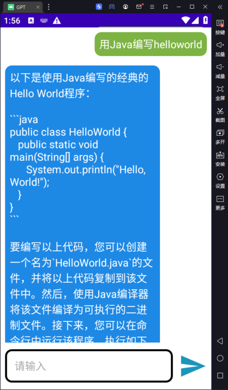

# ChatGPT Android

> 声明：此项目免费且作为开源学习使用。并且不会有任何形式的卖号、付费服务、讨论群、讨论组等行为。谨防受骗。


方便的话，点一手免费的Star哦！感谢！！！


## 功能

### 支持多平台GPT服务平台

+ [x] [OpenAI ChatGPT 系列模型](https://platform.openai.com/docs/guides/gpt/chat-completions-api)

+ [x] [One Api 系列代理服务](https://github.com/songquanpeng/one-api)

+ [x] [API2D 代理服务](https://api2d.com/)

+ [x] [其他代理服务]()

### 演示

​			




## 部署

1. 下载最新版的[Android Studio](https://developer.android.google.cn/studio?hl) 并安装
2. 打开项目
3. 找到MainActivity.java 路径如下

> app/src/main/java/com/example/gpt/MainActivity.java

4. Ctrl + F 搜索方法：callAPI
5. 主要修改的内容如下

```java
try {
    // 创建messages数组，包含用户角色和问题内容
    JSONArray messagesArray = new JSONArray();
    JSONObject systemMessage = new JSONObject();
    systemMessage.put("role", "system");
    systemMessage.put("content", "You are ChatGPT, a large language model trained by OpenAI. Follow the user's instructions carefully. Respond using markdown.");
    JSONObject userMessage = new JSONObject();
    userMessage.put("role", "user");
    userMessage.put("content", question);
    messagesArray.put(systemMessage);
    messagesArray.put(userMessage);
    // 构建完整的JSON请求体
    jsonBody.put("model", "gpt-3.5-turbo"); // 模型选择
    jsonBody.put("messages", messagesArray);

}catch (JSONException e) {
    throw new RuntimeException(e);
}

RequestBody body = RequestBody.create(jsonBody.toString(), JSON);
Request request = new Request.Builder()
    .url("https://api.openai.com/v1/chat/completions") // 服务器地址
    .header("Authorization", "Bearer sk-xxx") // 填写你的key
    .header("Content-Type", "application/json")
    .post(body)
    .build();
```

如果对接Open Ai只需修改Key就可以运行

可以根据自己的需求进行修改，如使用One Api还需替换服务器地址。由于本人没有4.0，所以此功能只能**文生文**创作

为防止OpenAi超时访问建议可以使用One API等代理平台

## 赞助

如果你觉得这个项目对你有帮助，并且情况允许的话，可以给我一点点支持，总之非常感谢支持～


## 关注我们


